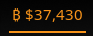

# Waybar BTC Module
maintained by: hkdb



### SUMMARY

A small python script that grabs the latest price for BTC with coinmarketcap.com api so that it can be displayed on waybar as a custom module.

### CHANGE

- 11162023 - Initial commit

### DEPENDENCIES

- Your own CMC API key
- Waybar
- Python3
  - requests
  - python-dotenv
  - pypi-json

### INSTALLATION

Clone repo:

```
git clone https://github.com/hkdb/waybar-btc.git
```

Run install script:

```
cd waybar-btc
./install.sh
# Paste your coinmarketcap api key when the script asks
```

Edit `~/.config/waybar/config`:

Put the following inside `"modules-right": []` ~

```
custom/btc
```

Put the following under Modules configuration section ~

```
"custom/btc": {
    "format": "₿ ${}",
    "interval": 10,
    "exec": "python ~/.local/lib/waybar-btc/getPrice.py",
    "exec-if": "exit 0", // always run; consider advanced run conditions
    "signal": 8,
    "tooltip": false,
},
```

Add the following into `~/.config/waybar/styles.css:

```
#custom-btc {
    padding: 0 3px;
    border-bottom: 2px;
    border-style: solid;
    color: #F7931A
}
```

### UPDATE

Pull from within the repo:

```
git pull
```

Run install script:

```
./install.sh
```

### DISCLAIMER

In no way do the maintainers make any guarantees. Please use at your own risk!

### RECOGNITION

This is a utility sponsored by [3DF Limited](https://3df.io)'s Open Source Initiative.

To Learn more please visit:

[https://osi.3df.io](https://osi.3df.io)
